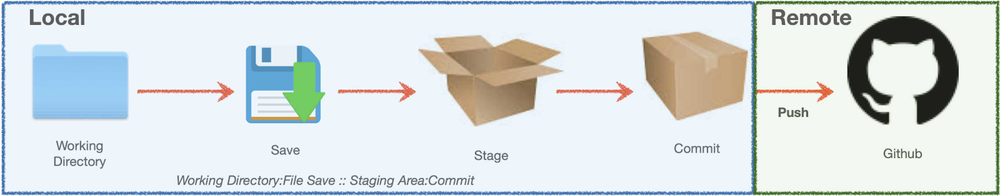
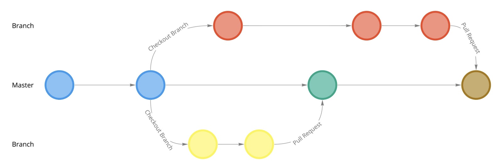

name: title
class: inverse, center, middle
# <span style="color:#F99012;">Git Workflows with RStudio</span>


### <span style="color:#F99012;">KATIE MASIELLO</span>
.large[RStudio Customer Success | 14 Sept 2020]

---
```{r setup, include=FALSE, warning=FALSE}
knitr::opts_chunk$set(echo = TRUE)
library(magrittr)
library(gt)
```

```{r include=FALSE, warning=FALSE}
xaringanExtra::use_share_again()
xaringanExtra::style_share_again(
  share_buttons = c("none")
)
```

# Scope for Today

.left-column[


]
.right-column[
* Essential Git / Github concept and vocabulary  

* Basic Git workflows in RStudio IDE  

* Automated Deployment with RStudio Connect <br>(*aka how you look like a superhero*) <br> 
]


---

class: center, middle, inverse 


---
# EIKIFJB <span style = 'font-size: 70%;'>(*everything I know is from Jenny Bryan*)</span>

.left-column[
<br>

]
.right-column[
[](https://happygitwithr.com/)
[<span style='font-size: 120%;'>https://happygitwithr.com/ </span>](https://happygitwithr.com/)
]
---
name: vocabulary 
# Vocabulary
```{r echo=FALSE, include=TRUE}
vocabulary <- rbind(c("Git", "A version control system that lets you manage history and changes"),
                    c("GitHub", "Online hosted version of your Git history so you and others can access it from any computer"),
                    c("Working Directory", "Where the file(s) you are working on are stored"),
                    c("Local", "Your Computer"), 
                    c("Remote", "An online version of your project"),
                    c("Stage", "Preparing files for commit; this allows you to break up your changes into smaller, logical pieces for each commit"),
                    c("Commit", "An annotated snapshot of your code; should be a (small) unit of work"),
                    c("Master or Main", "The main stream or branch of all development work"),
                    c("Branch", "A version/diversion of the master where you can add features, edit, etc. safely without affecting the Master"),
                    c("Pull Request", "The action of requesting changes in a branch be reviewed for incorporation (merging) into the Master")
                    ) %>% as.data.frame()
gt(vocabulary) %>% 
  tab_options(column_labels.hidden = TRUE) %>% 
  data_color(columns = vars(V1), colors = "#F99012", apply_to = "text") %>% 
  tab_style(style = list(cell_text(size = "medium")), locations = cells_body(everything())) %>% 
  tab_style(style = list(cell_text(weight = "bold")), locations = list(cells_body(columns=vars(V1))))
```

???
Overall we need to consider three places:
* Your working directory 
* The local repository
* The remote repository  

This vocabulary describes these places and how we move from one place to the other.

It's common to confuse your local working directory with your local repo because they live in more or less the same place.  In your Finder/Explorer window, you can see the evidence of your local repo if you show hidden files (Cmd + Shift + .  on Mac) and you'll reveal the .git folder and .gitignore file that overlay your working directory
---
## Basic Workflow

  

## Working with Branches

???
The mechanics of making a change, saving, staging, committing, and then pushing seems like a lot of steps to get something to GitHub but each of these actions is important.  
The process of working on a file, deciding you like it and saving it in your working directory is somewhat analogous to the act of staging files and then committing them to your local repo.  
As a best practice, think of commits as small bundles of work that you put into a box and seal up. These re the incremental changes or snapshots to your work.  
Think of staging as putting the files you've modified into the box before you seal it up with tape (or commit it). Put the things that go together in the box; for clarity later, avoid throwing all your work into one big box. 
Committing doesn't move our files or version history to GitHub.  That comes with a Push. 

Branches let us and others work on the project without disturbing the main or master stream. When we are ready, we can merge our changes back in with a Pull Request.
---
class: inverse, middle, left
<br>
<br>
# <span style='font-size: 200%;'>DEMO</span>
<br>
<br>
### with exercises left to reader: 
* Introduce yourself to Git, [Chapter 7 Happy Git with R](https://happygitwithr.com/hello-git.html)
* Cache credentials, [Chapter 10 Happy Git with R](https://happygitwithr.com/credential-caching.html)
* Review Chapters 4-14 (*they’re really not long*)
---
# Git-Backed Deployment Resources
* User documentation: https://docs.rstudio.com/connect/user/git-backed.html

* Admin documentation: https://docs.rstudio.com/connect/admin/content-management.html#git-backed
* Using git-backed deployment for development and prod: https://solutions.rstudio.com/2020/01/10/diffable-data-science-demo-with-bike-prediction/
<center>

</center>
---
    
# Git Resources

* Git workflows: 
  * Happy Git and GitHub for the useR:  https://happygitwithr.com/

* Git / Github best practices and use of Git in the RStudio IDE:
  * This section of *R Packages*, by Wickham: http://r-pkgs.had.co.nz/git.html

* Git cheat sheet:  https://education.github.com/git-cheat-sheet-education.pdf
